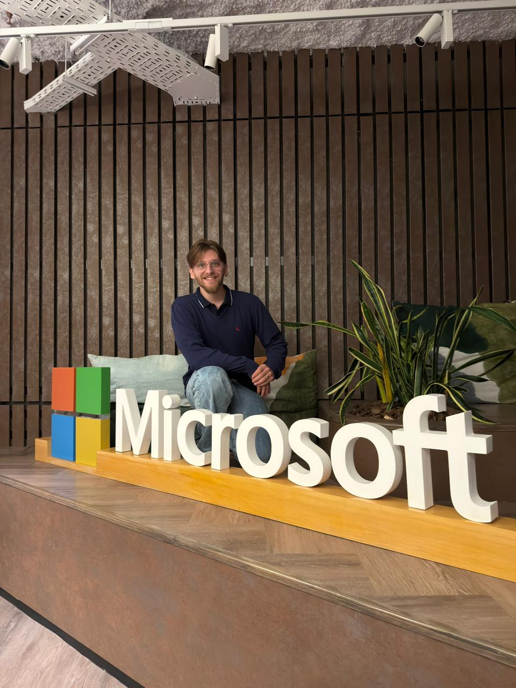
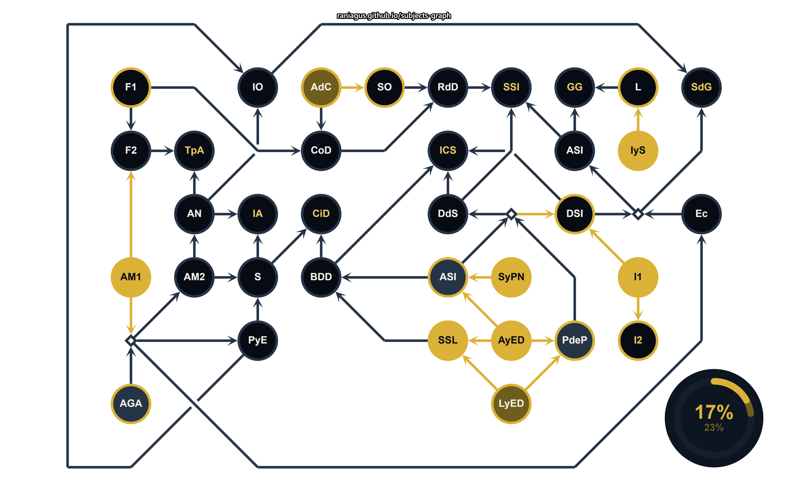
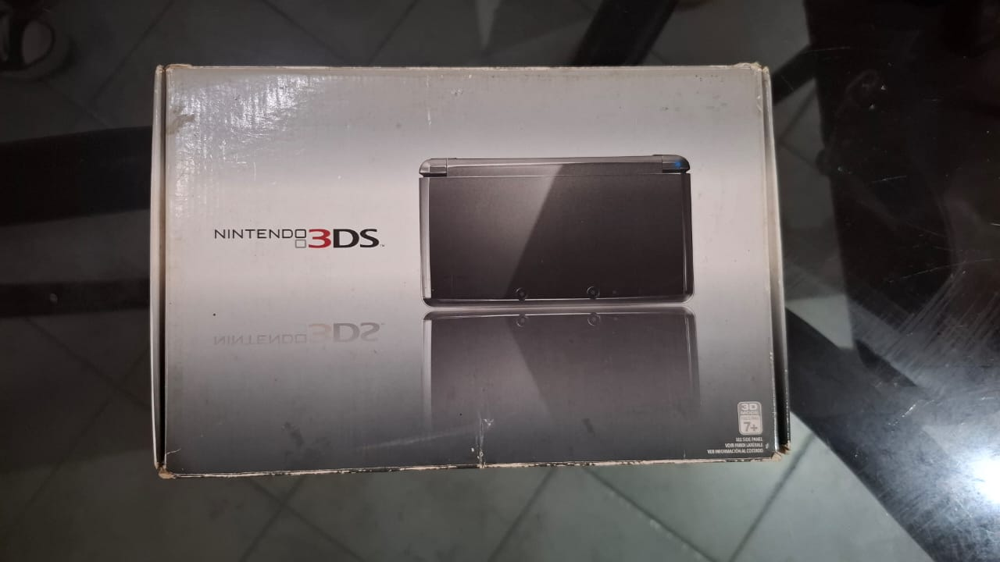
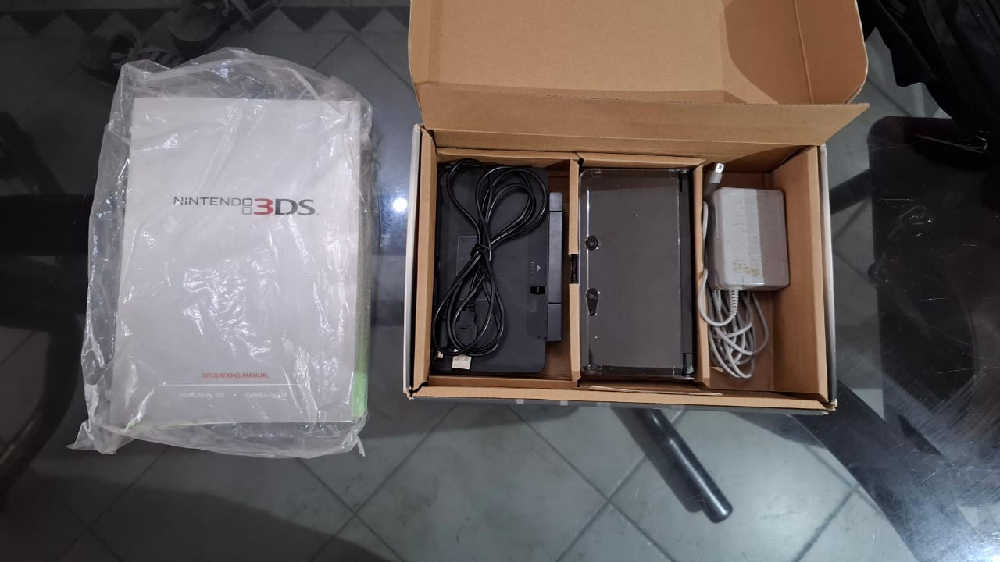

## ¡Hola, Mundo!

Mi nombre es Nahuel. Tengo 23 años, soy estudiante de ingeniería en sistemas (como casi todos en este curso) y, recientemente, ingresé como analista de soporte a sistemas y aplicaciones industriales en la empresa Loma Negra.  

  

## Mis  datos:
- Nombre Completo: Mariano Nahuel Laudani Rostagno
- Legajo: 209.043-0
- Hobbies: Cantante de la banda DUNK ([@dunk_band](https://www.instagram.com/dunk_band/)), taekwondo (actualmente en stand-by), gimnasio (por empezar) y juegos (cuando se puede :P).
- Carrera Profesional: Ingresé como soporte técnico onsite en el 2024 para Loma Negra, donde fui incorporandome al área de tecnología hasta finalmente incorporarme como analista de datos.
- Carrera Universitaria: Como sugerencia de uno de mis compañeros, les comparto mi humilde avance a la carrera desde mi ingreso en 2022:
  

## Dato Curioso:

Respecto a mi hobbie de consolas, actualmente tengo una PS2, una Nintendo Switch 2 y, como frutilla del postre, recientemente compré una Nintendo 3DS con todos sus accesorios:  
  
  
_No hablemos de la PC gamer. Su función actual es de trabajo y la facu, así que lo que más juego ahí es al Campus Virtual._  

Para ampliar un poco la historia de mis consolas, la PS2 me llegó como un regalo a mis 8 años, mientras que la 3DS fue un pequeño capricho que tuve desde los 12.  
Profundizando en los juegos, mis ganas de jugar a las diferentes entregas de Pokemon y de Mario (ya sean los Neww, 3D Land y los Mario & Luigi) sumado al catálogo de la DS fueron el pequeño motorcito para adquirir la consola.
